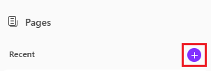
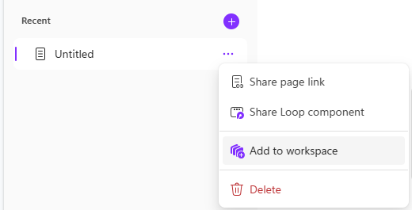

---
task:
    title: 'Task 3: Collaborate using Pages'
---

# Task 3: Collaborate Using Pages

In this task, you’ll explore the new **Pages** functionality, a dynamic, shareable space for collaboration and idea organization.

### Steps:

1. To launch Pages, open a new Edge browser tab and navigate to <a href="https://m365.cloud.microsoft/pages/" target="_blank">m365.cloud.microsoft/pages</a>.

1. If prompted, log into your work account.

1. If you've never used Pages before, select **Create new page** when prompted. 

1. Once **Pages** is open, select **Add a new page** (+ icon):

    

1. Give your new page a title, such as "People Matter Survey Insights."

1. In the body of Pages, paste the link to your **executive briefing.docx** document created in Task 2.

1. Click below the inserted document and select the Copilot logo next to the text "Use Copilot or just start typing...".

1. Type the following example prompt, or try your own prompt:

    ```text
    Based on the findings [paste link to executive briefing.docx], what are the top three recommendations for enhancing employee engagement, inclusion, and wellbeing in our department?
    ```

1. Use Pages as a collaborative space to work with your colleagues in real-time. Share the page by typing the "@" symbol followed by a colleague’s name.

1. After adding your colleague, click on their name to give them access. They will receive an email notification with a link to collaborate on the page.

    

1. Once your colleague has access, you can work together to refine the recommendations, add supporting data, and organize ideas into actionable steps.

### **TIP**:
 When using BizChat with the **work** tab selected, you can send Copilot's response directly to a new page by selecting **Edit in Pages**:


You can also share a page with a workspace in Loop by selecting the ellipsis (...) next to any page:



[Back to Index](https://microsoftlearning.github.io/Microsoft-365-Copilot-Immersion-Experience/)
