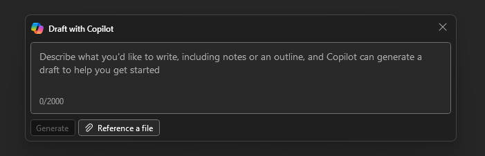

---
task:
    title: 'Task 2: Draft a document using Microsoft 365 Copilot in Word'
---

# Task 2: Draft a document using Microsoft 365 Copilot in Word

Based on your research using BizChat, use Copilot in Word to draft a briefing of key findings from the People Matter Survey to present at an upcoming employee town hall. This summary should be engaging and easy to understand, highlighting positive trends, areas of growth, and actionable steps the department is taking.

## Steps

1. Open the **copilot research.docx** document that you saved to your OneDrive account previously in Task 1. Copy the URL of the document by selecting the Share button in the upper-right corner, above the ribbon, and selecting **Copy Link** from the drop-down menu that appears.

    

1. Launch Microsoft Word from your browser (<a href="https://word.new" target="_blank">word.new</a>) or use the desktop application.

1. Open a new blank document.

1. Select the Copilot icon at the top of the blank document to open **Draft with Copilot**.

    

1. Enter the following prompt into the prompt field:

    ```text
    Based on the research findings in [link to Copilot Research.docx], draft an executive briefing for our upcoming employee town hall, focusing on positive trends, areas of improvement, and key actions to enhance employee engagement, inclusion, and wellbeing.
    ```

1. Select **Generate**. At this point, Copilot in Word extracts the information from your research document and drafts the proposal.

1. Review the draft that Copilot creates. If everything looks accurate, select **Keep it** in the Copilot window at the bottom of the drafted document and move on to the next step.

    However, if you'd like to refine the document further, explore the information in the **Iterate and Revise** section below.

1. Save the file to your OneDrive as **executive briefing.docx**, then copy the link to this document. (See Step 1 above for reference.)"

## Iterate and Revise

The iterative revision process enhances the quality, clarity, and impact of the town hall summary by making targeted adjustments based on audience needs. Here are example prompts to help refine specific sections:

<div style="background-color: #e0f7ff; padding: 10px; border-left: 5px solid #0078D4;">
<strong>Note:</strong> If you’ve already selected **Keep it** in the Copilot window, click anywhere in the body of the Word document or highlight text to make the Copilot icon appear. Then, click the icon to reopen Copilot.</div>
<BR>

For example, you might start with an initial draft of a proposal and prompt the following:

```text
Can you revise this briefing to make it more inspiring and accessible for a general employee audience?
```

After reviewing the updated version, you may further improve the document by focusing on specific sections, such as:

```text
Add a concluding section that reinforces the department’s commitment to supporting employees and fostering a positive workplace culture.
```

Experiment with different prompts to refine your summary, ensuring it resonates with employees and conveys a sense of positive momentum and commitment to their experience.

**Next**: [Task 3](https://microsoftlearning.github.io/Microsoft-365-Copilot-Immersion-Experience/Instructions/Labs/PubSec/Task_3.html)

[Back to Index](https://microsoftlearning.github.io/Microsoft-365-Copilot-Immersion-Experience/)
