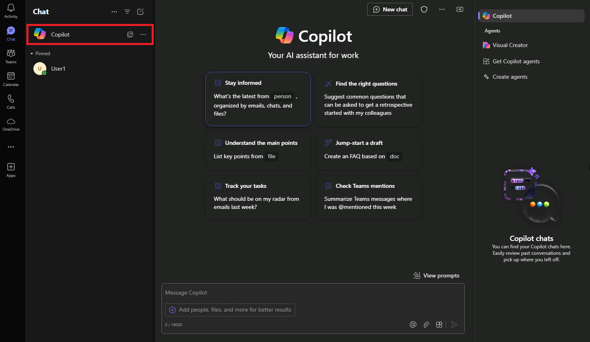

---
task:
    title: 'Task 3: Review communications and send a follow-up email'
---

# Task 3: Review communications and send a follow-up email


In this task, you’ll use Microsoft 365 Copilot Chat (Copilot Chat) in Teams to gather insights from recent interactions with a specific person on a specific topic. This will help you quickly catch up on recent communications, ensuring you’re well-prepared to follow up. Then, you’ll switch to Outlook to draft a follow-up email using Copilot in Outlook, allowing you to respond promptly and effectively based on your findings.

<div style="background-color: #e0f7ff; padding: 10px; border-left: 5px solid #0078D4;">
    <strong>Optional:</strong> If you have Teams and Outlook downloaded on your mobile device, you can follow along with the mobile version of this task 
    <a href="https://microsoftlearning.github.io/Microsoft-365-Copilot-Immersion-Experience/Instructions/Labs/PubSec/Task_3_mobile.html" target="_blank">here</a>.
</div>

## Steps

1. In **Microsoft Teams**, select **Copilot** at the top of the **Chat** pane.  This will open a **Copilot** window.
    
    

1. Use the prompt below to gather insights from recent interactions with a specific person. You can use the reference feature ("/") to reference the person directly, making it easier to pull relevant information:

    ```text
    Summarize my recent interactions with [/Name of Person] regarding [specific topic or project]. Organize the summary by key points or actions discussed, and include any follow-up items or outstanding questions that may require attention.
    ```
    <BR>
    <div style="background-color: #e0f7ff; padding: 10px; border-left: 5px solid #0078D4;">
    <strong>Note:</strong>
    Replace [Name of Person] with the person you’re focusing on, and [specific topic or project] with the relevant topic. Use the **/** character (slash) to reference internal contacts for quick access to recent interactions.
    </div>

1. Review the summary that Copilot provides. Ensure it covers key discussion points, action items, or questions that emerged from your recent interactions.

1. Copy the insights for reference as you draft your follow-up email.

1. Open **Outlook** and then select **New Mail**.

1. In the email draft, select **Copilot** from the ribbon, then choose **Draft with Copilot**.

    


1. Enter the following prompt to draft a follow-up email based on the insights you gathered in Copilot Chat:

    ```text
    Using the insights below, draft a follow-up email to [Name of Person] highlighting the key actions and next steps. Also, ask for a follow-up meeting to discuss further.

    [Paste insights from Copilot Chat here]
    ```
1. Review the email draft generated by Copilot. Make any necessary edits to personalize the message or address specific points from your interactions.

1.  Once the email is finalized, save it as a draft or send it directly through Outlook.

[Optional Task: Collaborate using Pages](https://microsoftlearning.github.io/Microsoft-365-Copilot-Immersion-Experience/Instructions/Labs/PubSec/Optional_Task_1.html)

[Back to Index](https://microsoftlearning.github.io/Microsoft-365-Copilot-Immersion-Experience/)