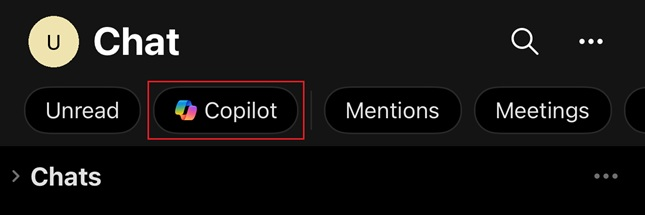
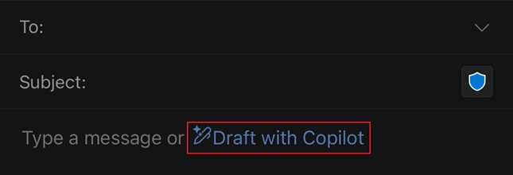

---
task:
    title: 'Task 4: Gathering Insights and Drafting a Follow-up Email'
---

### Task 3: Gathering Insights and Drafting a Follow-up Email

In this task, you’ll use Business Chat (BizChat) in Teams to gather insights from recent interactions with a specific person or on a specific topic. This will help you quickly get up to speed on recent communications, ensuring you’re well-prepared to follow up. Then, you’ll switch to Outlook Mobile to draft a follow-up email using Copilot, allowing you to respond promptly and effectively based on your findings.

### Steps:

1. In **Microsoft Teams** on your mobile device, select **Copilot** at the top of the **Chat** pane.  This will open a **Copilot** window.
    
    

1. Use the following prompt to gather insights from your recent interactions with a specific person. You can use the reference feature ("/") to reference the person directly, making it easier to pull relevant information:

    ```text
    Summarize my recent interactions with [/Name of Person] regarding [specific topic or project]. Organize the summary by key points or actions discussed, and include any follow-up items or outstanding questions that may require attention.
    ```
    <BR>
    <div style="background-color: #e0f7ff; padding: 10px; border-left: 5px solid #0078D4;">
    <strong>Note:</strong>
    Replace [Name of Person] with the person you’re focusing on, and [specific topic or project] with the relevant topic. Use the **/** character to reference internal contacts for quick access to recent interactions.
    </div>

1. Review the summary that Copilot provides. Ensure it covers key discussion points, action items, or questions that emerged from your recent interactions.

1. opy the insights for easy reference in drafting your follow-up email.

1. Switch to **Outlook** on your mobile device and then select **New Mail**.

1. In the email draft, open **Copilot** by selecting **Draft with Copilot**.

    


1. Enter the following prompt to draft a follow-up email based on the insights you gathered in BizChat:

    ```text
    Using the insights from below, draft a follow-up email to [Name of Person] highlighting some of the key actions and next steps. Also, ask for a follow-up meeting to discuss further.

    [Paste insights from BizChat here]
    ```
1. Review the email draft generated by Copilot. Make any necessary edits to personalize the message or address specific points from your interactions.

1. Once you’re satisfied with the email, save it as a draft or send it directly from Outlook Mobile.


